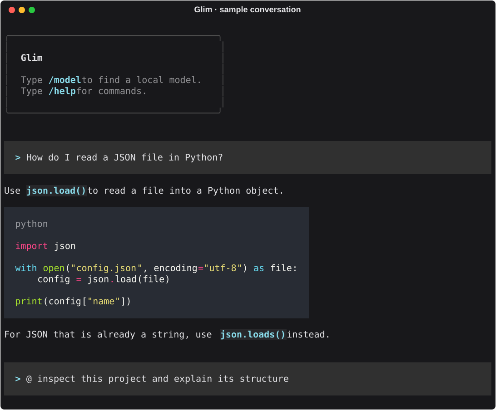

# Glim

[](https://github.com/anthonypdr/glim/actions/workflows/tests.yml)
[](https://www.python.org/downloads/)
[](LICENSE)

**Local chat. Project tools when you ask for them.**

Glim is a lightweight terminal client for the models you already run locally. Start with [LM Studio](https://lmstudio.ai/), [Ollama](https://ollama.com/), or another local server with OpenAI-compatible model and chat endpoints.

It provides a compact terminal experience without a large, always-on system prompt. Optional project tools are only attached when you explicitly ask for them.

> Glim is early-stage software. Review agent-proposed changes and approve commands deliberately.



*Sample conversation rendered with Glim's own terminal components. The response is illustrative; the editable composer is not shown.*

[Install](#install) · [LM Studio setup](#quick-start-with-lm-studio) · [Ollama setup](#use-with-ollama) · [Releases](https://github.com/anthonypdr/glim/releases) · [Report a bug](https://github.com/anthonypdr/glim/issues)

## Features

- Connects to LM Studio by default (`http://127.0.0.1:1234`)
- Shows the models currently running in LM Studio with `/model`
- Gives in-terminal connection steps when no model server or model is found
- Connects to other local OpenAI-compatible model servers with one environment variable
- Streams normal chat responses in a focused terminal interface
- Enables agent tools only for requests prefixed with `@`
- Lets the agent inspect and edit files inside the current project
- Requires approval for shell commands other than a small read-only allowlist
- Supports web search and readable web-page fetching in agent mode
- Keeps the input available during responses and queues follow-up requests
- Displays syntax-highlighted code blocks and a model, path, and conversation footer

## Install

You need **Python 3.10 or newer**, Git, a terminal, and a local model server.
Glim is a client: install and run the model separately. Your model determines
the RAM/VRAM you need. The steps below install from GitHub into an isolated
virtual environment.

### Linux / macOS

```bash
git clone https://github.com/anthonypdr/glim.git
cd glim
python3 -m venv .venv
source .venv/bin/activate
python -m pip install --upgrade pip
python -m pip install .
```

### Windows (PowerShell)

```powershell
git clone https://github.com/anthonypdr/glim.git
cd glim
py -3 -m venv .venv
.\.venv\Scripts\python.exe -m pip install --upgrade pip
.\.venv\Scripts\python.exe -m pip install .
```

On Linux/macOS, run `glim` while the environment is active. In a new terminal,
activate it again with `source /path/to/glim/.venv/bin/activate`.
On Windows, run `C:\path\to\glim\.venv\Scripts\glim.exe`; activation is not
required. Use the actual path to your checkout, and launch from the project
directory you want Glim to work in.

For a fixed alpha version, run `git checkout v0.1.0a1` after cloning and before
installing. See the [release notes](https://github.com/anthonypdr/glim/releases/tag/v0.1.0a1).

### Development install

After creating and activating the virtual environment, use an editable install
while working on Glim itself (on Windows, substitute `.\.venv\Scripts\python.exe`
for `python`):

```bash
python -m pip install -e .
```

## Quick start with LM Studio

1. Open LM Studio and load a chat-capable model.
2. Open LM Studio's **Developer** tab and turn on **Start server**. You can also run `lms server start`.
3. Change into the project you want help with.
4. Run:

```bash
glim
```

Type `/model` to display the models currently running in LM Studio and select one. If nothing is displayed, Glim explains how to load a model and start the local server directly in the terminal.

## Use with Ollama

1. [Install Ollama](https://docs.ollama.com/quickstart) and keep its app or service
   running. For a standalone CLI setup, run `ollama serve` in a separate terminal
   if the server is not already running.
2. Download a model that fits your machine, for example:

   ```bash
   ollama pull qwen3:8b
   ```

3. Launch Glim from your project directory:

   **Linux / macOS** (with Glim's environment active):

   ```bash
   GLIM_SERVER_URL=http://127.0.0.1:11434 GLIM_SERVER_NAME=Ollama glim
   ```

   **Windows (PowerShell):**

   ```powershell
   $env:GLIM_SERVER_URL = "http://127.0.0.1:11434"
   $env:GLIM_SERVER_NAME = "Ollama"
   & "C:\path\to\glim\.venv\Scripts\glim.exe"
   ```

4. Type `/model` and select the downloaded model. Start with a normal chat;
   `@` requests additionally require a model that supports tool calling.

Glim uses Ollama's [OpenAI-compatible API](https://docs.ollama.com/api/openai-compatibility).
Model discovery lists available models; it does not indicate which Ollama models
are currently loaded in memory. Model quality and tool support vary.

### Other compatible local servers

To connect to a local server that provides `/v1/models` and
`/v1/chat/completions`, set its base URL before launching:

```bash
GLIM_SERVER_URL=http://127.0.0.1:PORT GLIM_SERVER_NAME="My local server" glim
```

Replace `PORT` with the server's port. A trailing `/v1` is also accepted.
`GLIM_LMSTUDIO_URL` remains supported for an LM Studio URL override;
`GLIM_SERVER_URL` takes precedence if both are set.

## Using Glim

Type a normal message for lightweight chat:

```text
Explain this Python traceback.
```

Prefix a request with `@` to enable the agent and its tools for that request:

```text
@ inspect this project and explain its structure
@ read package.json and summarize the dependencies
@ fix the failing test in tests/test_api.py
@ run pytest
@ search the web for the current Python packaging guidance
```

`@ run COMMAND` directly runs a shell command through the same safety checks:

```text
@ run rg "TODO" .
```

Commands on the read-only allowlist run immediately. Other commands require
confirmation through the approval menu below; some destructive commands are
blocked. File-editing tools can write within the current project without a
separate approval prompt. These checks are not an operating-system sandbox.

### Built-in commands

| Command | What it does |
| --- | --- |
| `/help` | Show in-app help |
| `/model` | Display running LM Studio models, or selectable models from another compatible local server |
| `/status` | Show connection, model, directory, and context status |
| `/tools` | Show the tools available through `@` agent mode |
| `/clear` | Clear the shared chat and agent history |
| `/title NAME` | Rename the conversation displayed below the input |
| `/exit` | Quit Glim |

The input stays available while Glim works. Submit another message to queue it;
requests run in order. The footer shows the active model, working directory,
conversation title, and working or queued status. Titles start from your first
message and can be changed with `/title NAME`.

When a shell command needs approval, its command and a numbered menu appear
above the input. Press `1` or `Y` to allow once, or `2`, `N`, or `Esc` to decline.
You can also select with the arrow keys and confirm with Enter. Decline is
selected initially. Shortcuts apply when the input is empty; an existing draft
stays editable, and submitted follow-up messages are queued.
Slash commands are available after queued work finishes. Responses appear as
formatted paragraphs and complete code blocks, with language labels and syntax
highlighting.

The right side of the footer shows the percentage of request context used.
Glim uses LM Studio's loaded context window and reported token usage when
available. `~` marks an estimate (including while streaming); `Context —` means
the server did not expose the loaded context limit. This is per-request usage,
not a cumulative count across requests. `/clear` resets the displayed usage.

Normal chat and `@` requests share conversation history within the running
session, including earlier tool calls and results. Switching models keeps that
history; `/clear` resets it. Normal chat still runs without tool definitions or
agent instructions. History is held in memory and is not restored after restart.

## How it stays lightweight

Normal chat sends only your conversation to the local model server. The optional tool instructions and definitions are attached only for requests beginning with `@`; they are not permanently included in every request. That keeps the common path small while retaining project automation when you need it.

## Development

After installing the package, run the test suite from the repository root:

```bash
python -m unittest discover -s tests -v
```

Tests use mocked model responses and do not require a running model server.
GitHub Actions runs them on Linux, macOS, and Windows with Python 3.10 and 3.14.
This checks the package and automated tests; it is not a live-model certification
for every operating system or provider.

Regenerate the README's sample terminal preview with:

```bash
python scripts/render_preview.py
```

The package's command-line entry point is `glim.cli:main`. Launching `python -m glim` runs the same terminal application.

## Troubleshooting and feedback

- **Cannot connect / no models:** Check that the server is running, then use
  `/status` to inspect Glim's URL and `/model` to retry. Load a model in LM Studio
  or download one with Ollama first.
- **`glim` not found:** Activate the virtual environment, or run its executable
  by full path as shown above.
- **`venv` unavailable:** Install your operating system's Python venv support,
  then repeat the environment creation step.
- **Agent tools do not work:** Try normal chat first, then check that your chosen
  model and server support tool calling.

History lasts only for the current session. Web search and page fetching contact
external services when used in agent mode.

Found a problem? [Open an issue](https://github.com/anthonypdr/glim/issues) with
your OS, Python version, Glim version or commit, model/server, reproduction steps,
and expected versus actual behavior. Remove private project content from logs.
Small pull requests are welcome; include relevant tests for behavior changes.

## Development transparency

Glim is developed with AI-assisted coding tools. Bug reports, testing, and code
review from the community are welcome.

## License

MIT. See [LICENSE](LICENSE).
